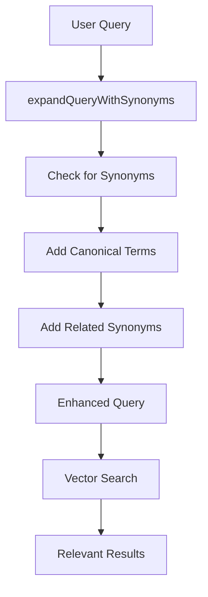

# 🔍 Synonym Strategy Documentation

## Overview

The Elastic Path Documentation Chatbot includes an intelligent synonym expansion system that automatically enhances user queries to improve search results. This system helps users find relevant information even when they use different terminology than what appears in the documentation.

## ✨ Key Features

- **Automatic Query Expansion**: User queries are automatically enhanced with synonyms before hitting the vector search
- **Context-Aware Mapping**: Synonyms are organized by context (integration, product, technical, etc.)
- **Multi-word Support**: Handles both single words and multi-word phrases
- **Performance Optimized**: Uses efficient Map-based lookups for fast processing
- **Development Logging**: Logs synonym expansions in development mode for debugging

## 🎯 Example Use Cases

| User Input | Expands To Include | Result |
|------------|-------------------|---------|
| "salesforce connect" | "salesforce connector", "salesforce integration" | Finds Salesforce integration documentation |
| "admin panel" | "Commerce Manager", "management console" | Finds Commerce Manager documentation |
| "PXM" | "Product Experience Manager", "catalog management" | Finds PXM documentation |
| "low-code" | "Composer", "builder", "workflow" | Finds Composer documentation |
| "custom fields" | "Flows", "custom data", "metadata" | Finds Flows documentation |

## 🏗️ Architecture

### Core Components

1. **`src/lib/synonymMappings.ts`**: Main synonym system with mappings and expansion logic
2. **`src/lib/mongoDbRetriever.ts`**: Integration point that applies synonym expansion before vector search
3. **`src/constants/prompts.ts`**: Enhanced prompts that inform the AI about synonym awareness
4. **`scripts/test-synonyms.ts`**: Test script to verify synonym functionality

### Data Structure

```typescript
interface SynonymGroup {
  canonical: string;    // The preferred term used in documentation
  synonyms: string[];   // Alternative terms users might use
  context?: string;     // Optional context for disambiguation
}
```

## 🔧 How It Works

### 1. Query Processing Flow



### 2. Expansion Algorithm

1. **Multi-word Priority**: Longer phrases are matched first (e.g., "salesforce connect" before "connect")
2. **Canonical Addition**: Adds the canonical term from documentation
3. **Related Synonyms**: Includes up to 2 related synonyms to broaden search
4. **Deduplication**: Removes duplicate terms to keep query clean

### 3. Integration Points

The synonym system integrates at these key points:

- **`findRelevantContent()`**: Expands queries for general documentation search
- **`findTechnicalContent()`**: Expands queries for API documentation search
- **AI Prompts**: Informs the AI about synonym awareness

## 🛠️ Configuration

### Adding New Synonyms

Edit `src/lib/synonymMappings.ts` to add new synonym groups:

```typescript
{
  canonical: "your_canonical_term",
  synonyms: ["synonym1", "synonym2", "synonym3"],
  context: "appropriate_context"
}
```

### Context Categories

Current contexts include:
- `integration`: Third-party integrations and connectors
- `product`: Elastic Path products and features
- `management`: Admin and management interfaces
- `technical`: APIs, endpoints, and technical concepts
- `commerce`: E-commerce specific terms
- `security`: Authentication and security
- `data`: Custom data and metadata
- `development`: Development tools and workflows
- `setup`: Configuration and installation
- `action`: Common user actions
- `troubleshooting`: Error handling and issues

## 🧪 Testing

### Running Tests

```bash
npm run test-synonyms
```

### Test Output Example

```
🔍 Testing Synonym Expansion System

Test 1: "I want to setup a salesforce connect"
------------------------------------------------------------
Contains synonyms: true
✅ Expanded: "I want to setup a salesforce connect salesforce connector salesforce integration salesforce connection"
💡 Suggested terms: salesforce connector

🎯 Testing the specific "salesforce connect" → "salesforce connector" case:
Original: "I want to setup a salesforce connect"
Expanded: "I want to setup a salesforce connect salesforce connector salesforce integration salesforce connection"
✅ SUCCESS: "salesforce connect" correctly expanded to include "salesforce connector"
```

### Manual Testing in Development

When running in development mode, the system logs synonym expansions:

```
🔍 Query expansion: "salesforce connect" → "salesforce connect salesforce connector salesforce integration"
```

## 📈 Performance Considerations

### Optimizations

- **Map-based Lookups**: O(1) lookup time for synonyms
- **Cached Maps**: Synonym maps are built once at startup
- **Limited Expansion**: Maximum 2 related synonyms to prevent query bloat
- **Length Sorting**: Longer phrases matched first for accuracy

### Monitoring

- Development logging shows expansion results
- Production logging includes successful expansions
- Vector search performance remains unaffected

## 🔍 Advanced Usage

### Custom Expansion Logic

You can customize the expansion behavior by modifying `expandQueryWithSynonyms()`:

```typescript
// Example: Add more synonyms for specific contexts
if (context === 'integration') {
  relatedSynonyms.slice(0, 3).forEach(related => {
    expandedTerms.add(related);
  });
}
```

### Context-Specific Handling

Add context-aware logic for different scenarios:

```typescript
// Example: Different handling for RFP vs documentation
export function expandQueryForRFP(query: string): string {
  // RFP-specific expansion logic
  return expandQueryWithSynonyms(query);
}
```

## 🛡️ Best Practices

### Synonym Management

1. **Use Clear Canonical Terms**: Choose the exact terms used in documentation
2. **Avoid Over-Expansion**: Too many synonyms can dilute search results
3. **Test Regularly**: Run `npm run test-synonyms` after changes
4. **Consider Context**: Group related terms by their usage context
5. **Monitor Usage**: Check development logs for effective expansions

### Adding New Terms

1. **Research Documentation**: Find the exact terms used in docs
2. **Consider User Language**: Think about how users would naturally phrase queries
3. **Test Impact**: Verify new synonyms improve search results
4. **Document Changes**: Update this documentation when adding significant synonyms

## 🚀 Future Enhancements

### Potential Improvements

- **Machine Learning**: Use ML to automatically discover synonyms from user behavior
- **Dynamic Mapping**: Update synonyms based on search success rates
- **Language Support**: Expand to support multiple languages
- **Industry Terms**: Add industry-specific terminology mappings
- **User Feedback**: Learn from user corrections and failed searches

### Integration Opportunities

- **Analytics Integration**: Track which synonyms lead to successful searches
- **A/B Testing**: Test different synonym strategies
- **User Suggestions**: Allow users to suggest missing synonyms
- **Automatic Updates**: Sync with documentation changes

## 📚 Related Documentation

- [Vector Search Setup](VECTOR_SEARCH_SETUP.md)
- [API Documentation](API_DOCUMENTATION.md)
- [Chat API Implementation](docs/02_chat_api_endpoint_.md)
- [Knowledge Retrieval](docs/03_knowledge_retrieval__vector_search__.md)

## 🆘 Troubleshooting

### Common Issues

**Synonyms Not Working**
- Check if terms are properly added to `SYNONYM_GROUPS`
- Verify case sensitivity (system uses lowercase matching)
- Run `npm run test-synonyms` to verify configuration

**Poor Search Results**
- Too many synonyms might dilute results
- Consider removing overly broad synonyms
- Test with specific user queries

**Performance Issues**
- Monitor query expansion in development logs
- Consider reducing number of related synonyms added
- Check for very long expanded queries

---

*This synonym system significantly improves the user experience by bridging the gap between how users naturally ask questions and how information is organized in the documentation.* 