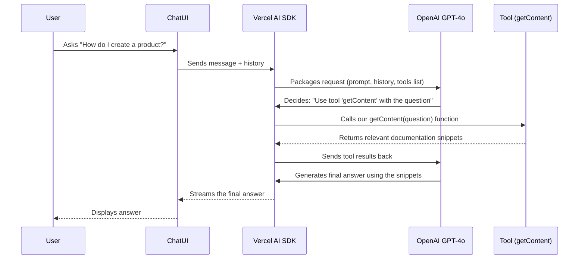

# Chapter 1: AI Core & Tool Integration (AI SDK)

Welcome to the `epdocs-chatbot` tutorial! We're starting our journey by looking at the "brain" of our chatbot.

Imagine you ask a chatbot a question like, "How do I create a product in Elastic Path Commerce Cloud?". How does it figure out the answer? Does it just *know* everything? Or does it need help? This chapter explores the core component responsible for understanding your question and deciding the best way to respond.

## What's the Big Idea? The Chatbot's Brain and Helpers

Think of the **AI Core** as the chatbot's central processing unit (CPU) or its main brain. It's powered by a very smart **Large Language Model (LLM)** – in our case, one of OpenAI's models like GPT-4o. This LLM is great at understanding language and generating text.

However, just like a human brain sometimes needs specific tools (like a calculator or a search engine), our chatbot's brain sometimes needs help. These helpers are called **Tools**. Tools are specific functions the chatbot can use to perform tasks like:

1.  **Searching Documents:** Looking up information in a knowledge base (like Elastic Path's documentation).
2.  **Calling APIs:** Interacting with other software systems directly (like fetching real-time data).

The **Vercel AI SDK (Software Development Kit)** is like the manager or conductor that makes the brain (LLM) and the helpers (Tools) work together smoothly. It handles the communication: taking your question, sending it to the LLM, figuring out if the LLM wants to use a tool, running the tool if needed, and finally getting the answer back to you.

So, the core idea is: **AI Core (LLM + AI SDK) + Tools = Smart Chatbot**.

## Key Concepts

Let's break down the main parts:

1.  **Large Language Model (LLM):** This is the AI that understands and generates human-like text (e.g., OpenAI's GPT-4o). It's trained on massive amounts of text data, making it excellent at conversation, summarizing, and answering questions based on the information it's given.
2.  **Vercel AI SDK:** This is a library (a collection of pre-written code) that makes it easier for developers to build AI applications. It simplifies tasks like:
    *   Sending messages to the LLM.
    *   Receiving responses (often streaming them word-by-word for a smoother user experience).
    *   Handling the process where the LLM decides to use a Tool.
    *   Calling the actual Tool code.
    *   Sending the Tool's results back to the LLM so it can generate the final answer.
3.  **Tools:** These are specific functions we define in our code that the LLM can choose to call. Each tool has:
    *   A **description:** Tells the LLM what the tool does (e.g., "get content from Elastic Path knowledge base").
    *   **Parameters:** Tells the LLM what information the tool needs to run (e.g., the user's question).
    *   An **execute function:** The actual code that runs when the tool is called.

## How it Works: From Question to Answer

Let's trace what happens when you ask the chatbot, "How do I create a product?":

1.  **You Ask:** You type your question into the chat interface.
2.  **AI SDK Steps In:** The Vercel AI SDK receives your message. It bundles it up with the conversation history, instructions for the chatbot (called a "system prompt"), and a list of available Tools.
3.  **LLM Thinks:** The AI SDK sends this package to the LLM (GPT-4o). The LLM reads your question, the instructions, and the descriptions of the tools. It thinks, "To answer 'How do I create a product?', I should probably look in the documentation." It sees a tool called `getContent` described as "get content from Elastic Path knowledge base".
4.  **LLM Decides:** The LLM tells the AI SDK: "Please use the `getContent` tool with the user's question."
5.  **AI SDK Delegates:** The AI SDK finds the `getContent` tool's code in our project and runs it, passing in your question.
6.  **Tool Works:** The `getContent` function (which we'll explore more in [Knowledge Retrieval (Vector Search)](03_knowledge_retrieval__vector_search__.md)) searches the Elastic Path documentation database for relevant information about creating products. It finds some helpful pages.
7.  **Tool Reports Back:** The `getContent` function returns the search results to the AI SDK.
8.  **AI SDK Informs LLM:** The AI SDK sends these search results back to the LLM, saying, "Here's what the `getContent` tool found."
9.  **LLM Answers:** The LLM now reads the search results and uses that information to craft a helpful, human-readable answer based *specifically* on the documentation found.
10. **AI SDK Delivers:** The AI SDK streams the LLM's final answer back to the chat interface, so you see it appear word by word.

Here's a simplified diagram of that flow:



## Under the Hood: A Peek at the Code

Let's see how this looks in the actual project code. The main logic lives in `src/app/api/chat/route.ts`. This file handles incoming chat messages.

**1. Setting up the Conversation with the AI SDK**

The `streamText` function from the Vercel AI SDK is central here. It manages the conversation with the LLM.

```typescript
// File: src/app/api/chat/route.ts (simplified)

import { streamText, tool } from 'ai'; // Import AI SDK functions
import { openai } from '@ai-sdk/openai'; // Import OpenAI helper
import * as prompts from '@/constants/prompts'; // Import our instructions
// ... other imports for tool functions ...

export async function POST(request: Request) {
    // Get messages and whether to use tools from the incoming request
    const { messages, useTools } = await request.json();

    // Determine the instructions (system prompt) and tools based on config
    const systemPrompt = /* ... Get instructions from prompts.ts ... */;
    const chosenTools = /* ... Get the list of available tools ... */;

    // Use the AI SDK's streamText function to talk to the LLM
    const result = streamText({
        model: openai('gpt-4o'), // Tell it which LLM to use
        messages: [ // Provide the conversation history and instructions
            { role: "system", content: systemPrompt }, // System instructions
            ...messages // Previous user/assistant messages
        ],
        tools: chosenTools, // Tell the LLM which tools are available
        toolChoice: 'auto', // Let the LLM decide if/when to use tools
    });

    // Send the LLM's response (streaming) back to the user's browser
    return result.toDataStreamResponse();
}
```

*   **Explanation:** We import `streamText` from `ai`. We tell `streamText` which `model` (GPT-4o) to use, the conversation `messages` (including our important system `prompt` from `prompts.ts`, covered in [Prompt Engineering](05_prompt_engineering_.md)), and the available `tools`. `toolChoice: 'auto'` lets the LLM decide if it needs a tool. Finally, `result.toDataStreamResponse()` sends the answer back to the user as it's generated.

**2. Defining a Tool for the LLM**

How does the LLM know about the `getContent` tool? We define it using the `tool` function from the AI SDK.

```typescript
// File: src/app/api/chat/route.ts (simplified tool definition)

import { tool } from 'ai';
import { z } from 'zod'; // Used to define expected input format
import { findRelevantContent } from '@/lib/mongoDbRetriever'; // The actual code!

// Define a collection of tools
const epccTools = {
    // The 'getContent' tool definition
    getContent: tool({
        // How the LLM understands what this tool does
        description: 'get content from Elastic Path knowledge base',
        // What input the tool expects (using 'zod' for structure)
        parameters: z.object({
            latestMessage: z.string().describe('the users question'),
        }),
        // The actual function to run when the LLM calls this tool
        execute: async ({ latestMessage }) => {
            console.log("AI decided to use the 'getContent' tool!");
            // Call the function that searches the database
            const content = await findRelevantContent(latestMessage);
            return content; // Return the results
        },
    }),
    // ... other tools like 'getTechnicalContent' or 'execGetRequest' defined here ...
};
```

*   **Explanation:** We use the `tool` function. The `description` is crucial – it's how the LLM understands *when* to use this specific tool. `parameters` defines exactly what information the tool needs (here, the user's message). `execute` points to the actual Javascript/Typescript function (`findRelevantContent`) that performs the action (searching the database). We'll learn more about `findRelevantContent` in [Knowledge Retrieval (Vector Search)](03_knowledge_retrieval__vector_search__.md) and API tools like `execGetRequest` in [API Execution Tools](04_api_execution_tools_.md).

## Conclusion

You've just learned about the heart of the `epdocs-chatbot`: the **AI Core** and its **Tool Integration**, orchestrated by the **Vercel AI SDK**. You saw how the chatbot uses a powerful LLM (like GPT-4o) as its brain and calls upon specialized Tools (like searching documentation) when needed to provide accurate and helpful answers. This combination allows the chatbot to go beyond simple canned responses and interact intelligently with information sources.

In the next chapter, we'll zoom out slightly and look at how the user's message actually gets *to* this AI Core. We'll explore the [Chat API Endpoint](02_chat_api_endpoint_.md), which acts as the front door for all chat interactions.

---

Generated by [AI Codebase Knowledge Builder](https://github.com/The-Pocket/Tutorial-Codebase-Knowledge)