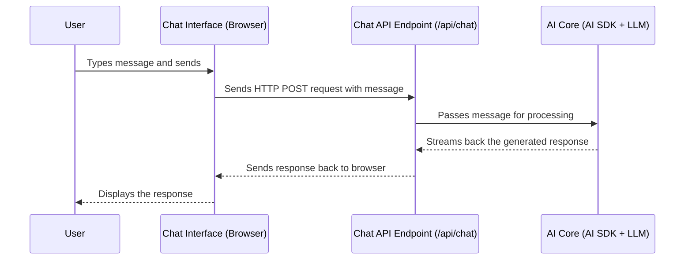

# Chapter 2: Chat API Endpoint

In [Chapter 1: AI Core & Tool Integration (AI SDK)](01_ai_core___tool_integration__ai_sdk__.md), we looked at the "brain" of our chatbot – how it understands questions and uses tools with the help of the Vercel AI SDK. But how does your message even *reach* that brain? Where does the conversation officially start?

That's where the **Chat API Endpoint** comes in!

## What's the Big Idea? The Chatbot's Front Door

Imagine you walk into a large office building. You don't just wander around looking for the person you need; you go to the **reception desk** first. You tell the receptionist who you are and what you need, and they figure out where to direct you.

The **Chat API Endpoint** is exactly like that reception desk for our `epdocs-chatbot`.

*   **It's the Entry Point:** When you type a message in the chat window and hit "Send," your message travels over the internet and arrives *first* at this specific digital address – the API endpoint.
*   **It Listens for Messages:** It's always waiting for new messages from users.
*   **It Kicks Off the Process:** Once it receives a message, it doesn't answer the question itself. Instead, it acts like an orchestrator. It takes your message and hands it off to the right place – the [AI Core & Tool Integration (AI SDK)](01_ai_core___tool_integration__ai_sdk__.md) we learned about in Chapter 1.
*   **It Sends Back the Answer:** After the AI Core figures out the answer (maybe by thinking, maybe by using a tool), it sends the final response back to the API endpoint. The endpoint then takes this response and sends it back to your chat window so you can see it.

So, the main job of the Chat API Endpoint is to be the **main communication hub**, receiving requests and sending back responses.

## How it Works: A Message's Journey

Let's follow your message, "How do I create a product?", from your screen to the chatbot's brain and back:

1.  **You Send:** You type your message in the chat interface (your web browser).
2.  **To the Endpoint:** Your browser sends the message over the internet to a specific URL – the address of our Chat API Endpoint (e.g., `/api/chat`). This is usually done using a web standard called an HTTP `POST` request.
3.  **Endpoint Receives:** The Chat API Endpoint code, running on a server, receives this `POST` request containing your message and potentially the conversation history.
4.  **Hand-off to AI Core:** The endpoint's code takes the message and passes it to the core logic we discussed in Chapter 1 – the part using the Vercel AI SDK and the Large Language Model (LLM).
5.  **AI Core Does Its Magic:** The AI Core processes the message, maybe uses tools like searching documents ([Knowledge Retrieval (Vector Search)](03_knowledge_retrieval__vector_search__.md)) or calling APIs ([API Execution Tools](04_api_execution_tools_.md)), and generates the final answer.
6.  **Response to Endpoint:** The AI Core sends the generated answer back to the Chat API Endpoint. Often, this happens piece by piece (streaming) to make the chat feel faster.
7.  **Back to You:** The Chat API Endpoint takes the answer (or the stream of answer pieces) and sends it back over the internet to your browser.
8.  **You See:** Your chat interface receives the answer and displays it on the screen.

Here’s a simple diagram of that flow:



## Under the Hood: A Peek at the Code

In our `epdocs-chatbot` project, which uses the Next.js framework, API endpoints are often defined inside files named `route.ts` within the `src/app/api` directory. Our chat endpoint lives in `src/app/api/chat/route.ts`.

**1. Defining the Endpoint Function (`POST`)**

Web servers need to know how to handle different types of requests. Sending a chat message is typically done with a `POST` request. So, our code defines an asynchronous function named `POST` to handle these.

```typescript
// File: src/app/api/chat/route.ts (simplified)

import { streamText } from 'ai'; // From Vercel AI SDK (Chapter 1)
import { openai } from '@ai-sdk/openai'; // OpenAI specifics
// ... other necessary imports ...

// This function handles incoming POST requests to /api/chat
export async function POST(request: Request) {
    // ... code inside the function ...
}
```

*   **Explanation:** We define an `async function POST`. The `request` object contains all the information sent from the user's browser, including the chat message. The `export` keyword makes this function accessible as the API endpoint.

**2. Getting the User's Message**

Inside the `POST` function, the first step is to get the data sent by the user's browser. This data is usually in a format called JSON.

```typescript
// File: src/app/api/chat/route.ts (simplified)

export async function POST(request: Request) {
    // Extract the messages and other info from the request body
    const { messages, useTools } = await request.json();

    // Now 'messages' holds the conversation history, including the latest one
    // 'useTools' tells us if the user wants to enable tool usage
    // ... rest of the code ...
}
```

*   **Explanation:** `request.json()` reads the data sent in the `POST` request and converts it into a JavaScript object. We then pull out the `messages` array (which contains the chat history) and the `useTools` flag.

**3. Calling the AI Core**

The API endpoint doesn't figure out the answer itself. It delegates this to the `streamText` function from the Vercel AI SDK, which we learned about in [Chapter 1: AI Core & Tool Integration (AI SDK)](01_ai_core___tool_integration__ai_sdk__.md).

```typescript
// File: src/app/api/chat/route.ts (simplified)

export async function POST(request: Request) {
    const { messages, useTools } = await request.json();
    // ... code to determine system prompt and tools ...

    // Hand off the messages and configuration to the Vercel AI SDK
    const result = await streamText({
        model: openai('gpt-4o'), // The LLM model
        messages: [ /* System prompt + user messages */ ], // Conversation context
        tools: { /* Available tools */ }, // Tools the AI can use
        toolChoice: 'auto', // Let the AI decide
        // ... other configurations ...
    });

    // ... code to send the result back ...
}
```

*   **Explanation:** This part looks very similar to what we saw in Chapter 1. The endpoint gathers the necessary information (messages, which tools are available based on `useTools` or configuration) and passes it all to `streamText`. `streamText` handles the complex interaction with the AI model and tools.

**4. Sending the Response Back**

Once `streamText` starts generating a response (or finishes), the endpoint needs to send it back to the user's browser. The Vercel AI SDK provides a handy way to send streaming responses.

```typescript
// File: src/app/api/chat/route.ts (simplified)

export async function POST(request: Request) {
    // ... code to get messages and call streamText ...
    const result = await streamText({ /* ... configuration ... */ });

    // Convert the AI's streaming response into a format the browser understands
    // and send it back.
    return result.toDataStreamResponse();
}
```

*   **Explanation:** The `result` object returned by `streamText` knows how to handle streaming data. Calling `result.toDataStreamResponse()` creates the correct type of response that the browser can receive and display incrementally, making the chat feel responsive.

Essentially, the code in `src/app/api/chat/route.ts` acts as the controller: it receives the request, prepares the data, calls the core AI logic, and then formats and sends the response back.

## Conclusion

You've now learned about the **Chat API Endpoint** – the essential front door or reception desk for our `epdocs-chatbot`. You understand its role:

*   Receiving user messages via HTTP requests.
*   Orchestrating the process by handing off the message to the [AI Core & Tool Integration (AI SDK)](01_ai_core___tool_integration__ai_sdk__.md).
*   Returning the final, generated response back to the user's browser, often using streaming.

This endpoint is the crucial bridge between the user's chat interface and the complex processing happening within the chatbot's brain.

In the next chapter, we'll dive deeper into one of the most important tools our chatbot uses: searching the documentation. We'll explore how [Knowledge Retrieval (Vector Search)](03_knowledge_retrieval__vector_search__.md) allows the chatbot to find relevant information within a large set of documents.

---

Generated by [AI Codebase Knowledge Builder](https://github.com/The-Pocket/Tutorial-Codebase-Knowledge)