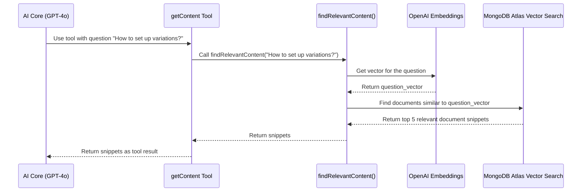

# Chapter 3: Knowledge Retrieval (Vector Search)

In the previous chapter, [Chat API Endpoint](02_chat_api_endpoint_.md), we saw how your message arrives at the chatbot's "front door." Now, let's explore one of the most powerful tools the chatbot uses *after* receiving your message: finding specific information within a large library of documentation.

## What's the Big Idea? The Hyper-Efficient Librarian

Imagine you ask the chatbot, "How do I set up product variations in Elastic Path?". The chatbot doesn't inherently *know* the answer from its general training. It needs to look it up in the *specific* Elastic Path documentation.

But how does it find the *right* documents efficiently, especially if your question uses slightly different words than the documentation? Searching just for keywords like "product" or "variations" might return too many irrelevant results.

This is where **Knowledge Retrieval** using **Vector Search** comes in. Think of it like a hyper-efficient librarian:

*   **Understands Meaning, Not Just Words:** Instead of just matching keywords, this system understands the *semantic meaning* or the *concepts* behind your question.
*   **Organized by Meaning:** The "library" (our documentation database) isn't organized alphabetically or by keyword, but by the *meaning* of the content.
*   **Finds Similar Concepts:** It quickly finds the documents in the library that discuss the same *ideas* as your question, even if they use different phrasing.

This system allows our chatbot to provide answers grounded in the actual documentation, making it much more accurate and trustworthy for specific technical questions.

## Key Concepts: Embeddings and Vector Databases

How does this "understanding meaning" magic work? Let's break it down:

1.  **Embeddings (Numerical Meaning):**
    *   At the heart of this system is a concept called **embeddings**. An AI model (specifically, an *embedding model* like OpenAI's `text-embedding-3-small`) reads a piece of text (your question, or a chunk of documentation) and converts its meaning into a list of numbers. This list of numbers is called a **vector**.
    *   **Analogy:** Imagine you could represent the "feeling" of a sentence with coordinates on a map. Sentences with similar feelings (e.g., happy sentences) would have coordinates close to each other, while sentences with different feelings (e.g., happy vs. sad) would be far apart. Embeddings do something similar, but for semantic *meaning*, using hundreds or thousands of "dimensions" (numbers) instead of just two map coordinates.
    *   Crucially, texts with similar meanings will have similar vector representations (their lists of numbers will be mathematically close).

2.  **Vector Database (MongoDB Atlas Vector Search):**
    *   Now that we can turn text into numbers (vectors), where do we store them? We use a specialized database designed to handle these vectors efficiently. In our project, we use **MongoDB Atlas Vector Search**.
    *   **Analogy:** Think back to our hyper-efficient librarian. Their library isn't just rows of books; it's more like a multi-dimensional map where books about similar topics are physically placed close together. A vector database does this digitally.
    *   When we first set up the chatbot, we process all the Elastic Path documentation. Each piece of documentation is converted into a vector using the embedding model and stored in the MongoDB Atlas Vector Search database, along with the original text.

3.  **Similarity Search:**
    *   This is the process of finding relevant information. When you ask a question:
        1.  Your question is converted into a vector using the *same* embedding model.
        2.  This "question vector" is sent to the MongoDB Atlas Vector Search database.
        3.  The database compares the question vector to all the document vectors it stores.
        4.  It calculates the "similarity" (mathematical closeness) between the question vector and the document vectors.
        5.  It returns the original text chunks corresponding to the document vectors that are *most similar* (closest) to your question vector.

## How it's Used in `epdocs-chatbot`

Remember the **Tools** we discussed in [Chapter 1: AI Core & Tool Integration (AI SDK)](01_ai_core___tool_integration__ai_sdk__.md)? Two key tools, `getContent` and `getTechnicalContent`, rely heavily on this vector search mechanism.

When the main AI (like GPT-4o) decides it needs information from the documentation or API references to answer your question, it calls one of these tools.

Let's look at the `getContent` tool definition again, focusing on the `execute` part:

```typescript
// File: src/app/api/chat/route.ts (simplified tool definition)
import { tool } from 'ai';
import { z } from 'zod';
// This is the function that performs the vector search!
import { findRelevantContent } from '@/lib/mongoDbRetriever';

const epccTools = {
    getContent: tool({
        description: 'get content from Elastic Path knowledge base',
        parameters: z.object({
            latestMessage: z.string().describe('the users question'),
        }),
        // This part runs when the AI uses the tool
        execute: async ({ latestMessage }) => {
            console.log("AI using 'getContent' tool for:", latestMessage);
            // Call the function to perform the vector search
            const content = await findRelevantContent(latestMessage);
            // Return the results found in the database
            return content;
        },
    }),
    // ... other tools ...
};
```

*   **Explanation:** When the AI Core decides to use `getContent`, it provides the user's `latestMessage`. The `execute` function then calls `findRelevantContent(latestMessage)`. This `findRelevantContent` function is where the vector search magic happens. It takes the user's question, performs the similarity search against the documentation vectors in MongoDB, and returns the most relevant text snippets. The `getTechnicalContent` tool works similarly but searches a different collection in MongoDB containing API reference material.

## Under the Hood: The Journey of a Search

Let's trace the steps when `findRelevantContent` is called:

1.  **Input:** The function receives the user's question (e.g., "How do I set up product variations?").
2.  **Get Embedding:** It uses an OpenAI embedding model (via `OpenAIEmbeddings` library) to convert the question text into a numerical vector.
3.  **Query Database:** It sends this question vector to MongoDB Atlas Vector Search.
4.  **Similarity Search:** MongoDB compares the question vector to the pre-calculated vectors of all the documentation chunks stored in the database. It uses a special index (like `vector_index`) to do this *very* quickly.
5.  **Retrieve Results:** MongoDB identifies the top 'N' (e.g., top 5) document chunks whose vectors are mathematically closest to the question vector.
6.  **Return Text:** It retrieves the original text and metadata (like the source page) for these top N chunks.
7.  **Output:** The function returns these relevant text snippets back to the AI Core.

Here’s a diagram showing that flow:



## Diving Deeper into the Code

The core logic for vector search lives in `src/lib/mongoDbRetriever.ts`.

**1. The `findRelevantContent` Function:**

This function orchestrates the search for general documentation.

```typescript
// File: src/lib/mongoDbRetriever.ts (simplified)
import { MongoDBRetriever } from './mongoDbRetriever'; // Our class

export async function findRelevantContent(question: string) {
    console.log(`Searching documentation for: ${question}`);
    // Configuration for database connection, API keys etc.
    // (See [Configuration Files](06_configuration_files_.md))
    const config = { /* ... database/API details ... */ };

    // Create an instance of our retriever helper class
    const agent = new MongoDBRetriever();
    try {
        // Initialize connection to DB and embeddings model
        await agent.init(config);

        // Perform the similarity search!
        const results = await agent.similaritySearch(question);

        // Log sources and return the found document snippets
        console.log(`Found content sources: ...`);
        return results;
    } catch (error) {
        console.error('Error during MongoDB retrieval:', error);
        throw error;
    }
}
```

*   **Explanation:** This function gets the necessary configuration (database address, API keys - managed via [Configuration Files](06_configuration_files_.md)), creates a `MongoDBRetriever` object, initializes it, and then calls `agent.similaritySearch(question)` to get the results from the database.

**2. The `MongoDBRetriever` Class:**

This class handles the interaction with the OpenAI embedding model and the MongoDB vector store.

```typescript
// File: src/lib/mongoDbRetriever.ts (simplified class)
import { MongoDBAtlasVectorSearch } from '@langchain/mongodb';
import { OpenAIEmbeddings } from '@langchain/openai';
import { MongoClient } from 'mongodb';
import { AgentConfig } from '@/types/agent'; // Type for configuration

export class MongoDBRetriever {
    private vectorStore!: MongoDBAtlasVectorSearch; // Holds the connection

    // Sets up the connection using configuration
    async init(config: AgentConfig) {
        // 1. Setup the AI model to create embeddings (vectors)
        const embeddings = new OpenAIEmbeddings({
            openAIApiKey: config.openaiApiKey,
            modelName: "text-embedding-3-small", // Specific model
        });

        // 2. Connect to the MongoDB database
        const client = new MongoClient(config.mongodbUri);
        await client.connect();
        const collection = client.db(config.dbName).collection(config.collectionName);

        // 3. Prepare the Langchain Vector Search component
        this.vectorStore = new MongoDBAtlasVectorSearch(embeddings, {
            collection: collection,
            indexName: config.indexName || "vector_index", // The special DB index
        });
    }

    // Performs the actual search
    async similaritySearch(query: string, topK: number = 5) {
        // Use the vectorStore to find documents similar to the query
        return await this.vectorStore.similaritySearch(query, topK);
    }
}
```

*   **Explanation:**
    *   The `init` method sets everything up: it creates an `OpenAIEmbeddings` object (using your API key) to turn text into vectors, connects to the specific MongoDB `collection`, and then initializes the `MongoDBAtlasVectorSearch` component, telling it which collection and `indexName` to use for searching.
    *   The `similaritySearch` method is straightforward: it takes the user's `query` text, and the `vectorStore` (which already knows how to create embeddings and talk to the database) handles the process of converting the query to a vector and finding the `topK` most similar documents in MongoDB.

## Conclusion

You've now learned about the powerful **Knowledge Retrieval** system using **Vector Search** that allows `epdocs-chatbot` to find relevant information within Elastic Path's documentation. You understand the key concepts:

*   **Embeddings:** Turning text meaning into numbers (vectors).
*   **Vector Database (MongoDB Atlas Vector Search):** Storing and efficiently searching these vectors.
*   **Similarity Search:** Finding documents with meanings similar to the user's question.

This mechanism is crucial for enabling the chatbot to answer specific technical questions accurately by grounding its responses in the provided knowledge base. It's the chatbot's "research assistant," quickly finding the right information when needed.

But what if the chatbot needs to do more than just *retrieve* stored information? What if it needs to interact with live systems or external APIs? In the next chapter, we'll explore how the chatbot uses [API Execution Tools](04_api_execution_tools_.md) to perform actions in the real world.

---

Generated by [AI Codebase Knowledge Builder](https://github.com/The-Pocket/Tutorial-Codebase-Knowledge)