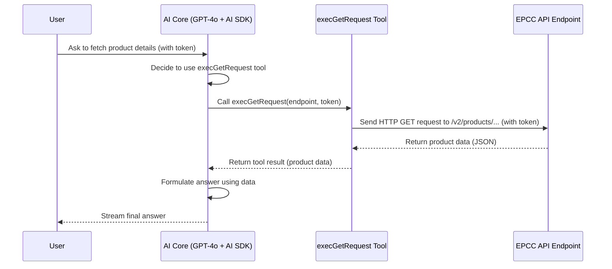

# Chapter 4: API Execution Tools

In the last chapter, [Knowledge Retrieval (Vector Search)](03_knowledge_retrieval__vector_search__.md), we saw how our chatbot acts like a super-smart librarian, quickly finding relevant information within the Elastic Path documentation. But what if we need the chatbot to do more than just *read* existing information? What if we want it to interact with the *live* Elastic Path system?

For example, maybe you want to ask, "Can you show me the current details for product ID 'xyz123'?" or even, "Create a new product category named 'Special Offers'". Answering these questions requires more than just looking up documents; it requires interacting directly with the Elastic Path Commerce Cloud (EPCC) system itself.

## What's the Big Idea? The Chatbot's Remote Controls

Think of the chatbot's knowledge retrieval tool as its library card. It can use it to look things up. But **API Execution Tools** are like a set of **remote controls** for specific web services – in our case, the Elastic Path Commerce Cloud (EPCC) API.

*   **Interacting with the Live System:** These tools allow the chatbot to talk directly to the EPCC system over the internet.
*   **Taking Actions:** The chatbot can use these tools to:
    *   **Fetch live data:** Get the latest information about a specific product, order, or customer (like using a `GET` remote button).
    *   **Send new data:** Create something new, like a product or a customer (like using a `POST` remote button).
    *   **Update existing data:** Modify information that's already there (like using a `PUT` remote button).
*   **AI Makes the Call:** Just like with the knowledge retrieval tool, the AI Core ([AI Core & Tool Integration (AI SDK)](01_ai_core___tool_integration__ai_sdk__.md)) decides *when* it needs to use one of these remote controls. If your question requires live data or an action in EPCC, the AI figures out which remote (tool) is needed and what "buttons to press" (which information to send).

So, API Execution Tools give our chatbot the ability to not just answer questions *about* EPCC, but to actively *use* EPCC based on your requests.

## Key Concepts

Let's clarify a few terms:

1.  **API (Application Programming Interface):** Think of an API as a menu that one software program provides so other programs can interact with it. The **EPCC API** is the specific "menu" that Elastic Path provides for developers (and our chatbot!) to interact with the Commerce Cloud platform programmatically. It defines a set of rules and URLs (endpoints) for requesting data or performing actions.
2.  **HTTP Methods (The "Buttons"):** When interacting with APIs over the web, we use standard commands called HTTP methods. The main ones our chatbot uses are:
    *   `GET`: Used to retrieve or fetch data (e.g., "Get me the product details").
    *   `POST`: Used to send new data to create something (e.g., "Create a new customer").
    *   `PUT`: Used to update existing data (e.g., "Update the price of this product").
3.  **API Execution Tools (The "Remotes"):** In our `epdocs-chatbot` code, these are specific `tool` functions (like `execGetRequest`, `execPostRequest`, `execPutRequest`) defined using the Vercel AI SDK. Each tool is designed to perform a specific HTTP method against the EPCC API. The AI chooses the right tool based on the user's request and the tool's `description`.

## How it Works: From Request to Action

Let's imagine you ask the chatbot: "Fetch the details for the product with ID 'prod-001'. My API token is 'abc...'".

1.  **You Ask:** Your request goes through the [Chat API Endpoint](02_chat_api_endpoint_.md) to the AI Core.
2.  **AI Core Decides:** The AI (GPT-4o) analyzes your request. It understands you want to *fetch* data (`GET`) related to a specific product (`prod-001`) and you've provided an API token (`abc...`). It looks at its available tools and sees one called `execGetRequest` described as "execute a GET request...". It decides this is the right tool.
3.  **AI Core Instructs Tool:** The AI tells the Vercel AI SDK: "Use the `execGetRequest` tool. The `endpoint` should probably be something like `/v2/products/prod-001` (it might figure this out or ask `getTechnicalContent` first), and the `token` is 'abc...'."
4.  **Tool Code Runs:** The AI SDK calls the actual `execute` function associated with the `execGetRequest` tool, passing in the endpoint and token.
5.  **API Call:** The `execute` function (code we wrote in `src/lib/execRequests.ts`) constructs and sends a real HTTP GET request over the internet to the EPCC API endpoint (`https://useast.api.elasticpath.com/v2/products/prod-001`) including the necessary authorization token.
6.  **EPCC Responds:** The EPCC API processes the request, finds the product details, and sends back a response (usually in JSON format) containing the product information.
7.  **Tool Reports Back:** The `execute` function receives the response from the EPCC API and returns it to the AI Core via the AI SDK.
8.  **AI Formulates Answer:** The AI Core gets the successful result (the product data) from the tool. It then uses this data to generate a user-friendly answer like, "Okay, I found the details for product 'prod-001'. Its name is 'Super Widget', and the price is $19.99..."
9.  **Answer Delivered:** The AI SDK streams the final answer back to your chat interface.

Here’s a simplified diagram:



## Under the Hood: A Peek at the Code

**1. Defining the API Tool (`execGetRequest`)**

Just like the `getContent` tool, we define API tools using the `tool` function from the Vercel AI SDK within `src/app/api/chat/route.ts`.

```typescript
// File: src/app/api/chat/route.ts (simplified tool definition)
import { tool } from 'ai';
import { z } from 'zod';
// Import the function that actually makes the web request
import { execGetRequest } from '@/lib/execRequests';

const epccTools = {
    // ... other tools like getContent ...

    execGetRequest: tool({
        // Description tells the AI *when* to use this tool
        description: 'execute a GET request to the EPCC API endpoint. Needs endpoint, token, and optional params.',
        // Parameters define what info the AI needs to provide
        parameters: z.object({
            endpoint: z.string().describe('the API endpoint path (e.g., /v2/products/xyz)'),
            token: z.string().describe('the Elastic Path API bearer token'),
            params: z.record(z.string(), z.string()).optional().describe('optional query parameters'),
        }),
        // The function to run when the tool is called
        execute: async ({ endpoint, token, params }) => {
            console.log(`AI using 'execGetRequest' for: ${endpoint}`);
            try {
                // Call the helper function to make the actual API call
                const result = await execGetRequest(endpoint, token, params);
                // Return the data received from the API
                return result || { message: "Request completed, no data returned." };
            } catch (error: unknown) {
                // Handle errors if the API call fails
                const message = error instanceof Error ? error.message : "API request failed";
                console.error("API Tool Error:", message);
                return { error: message }; // Report error back to AI
            }
        },
    }),
    // ... tools for POST (execPostRequest) and PUT (execPutRequest) defined similarly ...
};
```

*   **Explanation:**
    *   The `description` guides the AI. It mentions `GET`, `endpoint`, `token`, and `params`.
    *   `parameters` uses `zod` to define the expected inputs: the API `endpoint` path, the authentication `token`, and optional `params`. Crucially, the description notes that the `token` is required. If the AI doesn't have it, it knows it needs to ask the user first based on the prompt instructions.
    *   `execute` is the function that runs. It takes the parameters provided by the AI and calls *another* function, `execGetRequest` (from a different file), which does the real work of talking to the EPCC API. It also includes basic error handling.

**2. Making the Actual API Call (`execGetRequest` helper)**

The `execute` function above calls a helper function defined in `src/lib/execRequests.ts`. This function uses the standard web `fetch` API to make the HTTP request.

```typescript
// File: src/lib/execRequests.ts (simplified GET helper)

// Helper to create standard request headers, including Authorization
function createHeaders(token: string) {
    return {
        'Authorization': `Bearer ${token}`, // Use the provided token!
        'Content-Type': 'application/json',
        'Accept': 'application/json',
    };
}

// The main EPCC API base URL
function getBaseurl() {
    return 'https://useast.api.elasticpath.com';
}

// Function to execute a GET request
export async function execGetRequest(
    endpoint: string, // e.g., "/v2/products/prod-001"
    token: string,    // e.g., "abc..."
    params: Record<string, any> = {} // Optional parameters
): Promise<any> {
    const baseurl = getBaseurl();
    const apiUrl = baseurl + endpoint; // Construct full URL
    console.log(`Making GET request to: ${apiUrl}`);

    try {
        // Use the built-in 'fetch' function to make the web request
        const response = await fetch(apiUrl, {
            method: 'GET', // Specify the HTTP method
            headers: createHeaders(token), // Add authentication token header
            // ... potentially add params here ...
        });

        // Check if the API reported success (e.g., status code 200 OK)
        if (!response.ok) {
            // If not okay, throw an error with the status info
            throw new Error(`API Error: ${response.status} ${response.statusText}`);
        }

        // If okay, parse the JSON data from the response body
        return await response.json();
    } catch (error) {
        console.error('Error in execGetRequest:', error);
        // Re-throw the error so the tool definition can catch it
        throw error;
    }
}

// Similar functions exist for POST (execPostRequest) and PUT (execPutRequest)
// They would set method to 'POST' or 'PUT' and include a 'body' option in fetch.
```

*   **Explanation:**
    *   This function takes the `endpoint` path and the `token`.
    *   It constructs the full API `apiUrl`.
    *   It uses the standard `fetch` command with `method: 'GET'`.
    *   Crucially, it calls `createHeaders(token)` to add the `Authorization: Bearer <token>` header, which is how the EPCC API authenticates the request.
    *   It checks if the `response` was successful (`response.ok`). If not, it throws an error.
    *   If successful, it parses the response data (expected to be JSON) using `response.json()` and returns it.
    *   Functions like `execPostRequest` and `execPutRequest` follow a similar pattern but set the `method` to `POST` or `PUT` and include a `body` containing the data to be sent.

## Conclusion

You've now learned about **API Execution Tools**, the powerful "remote controls" that allow the `epdocs-chatbot` to go beyond retrieving stored information and interact directly with the live Elastic Path Commerce Cloud API. You understand:

*   They allow the chatbot to **fetch live data (GET)**, **create new items (POST)**, or **update existing items (PUT)**.
*   The AI Core decides **which tool to use** based on the user's request and the tool's description.
*   The tool's code uses standard web requests (`fetch`) to communicate with the **EPCC API**, handling things like **authentication tokens** and **response data**.

These tools significantly enhance the chatbot's capabilities, enabling it to perform actions and provide real-time information. However, getting the AI to use these tools correctly, safely, and effectively requires careful instruction.

In the next chapter, we'll explore [Prompt Engineering](05_prompt_engineering_.md), the art and science of writing the instructions (prompts) that guide the AI's behavior, including how it decides when and how to use both knowledge retrieval and API execution tools.

---

Generated by [AI Codebase Knowledge Builder](https://github.com/The-Pocket/Tutorial-Codebase-Knowledge)