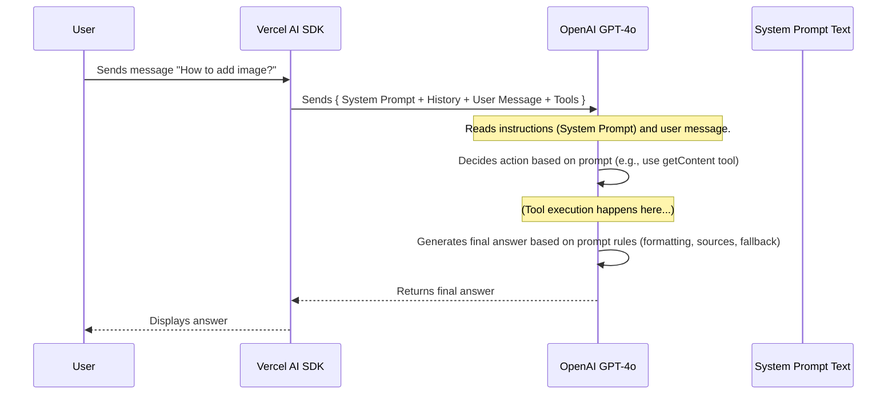

# Chapter 5: Prompt Engineering

In [Chapter 4: API Execution Tools](04_api_execution_tools_.md), we explored how our chatbot can use "remote controls" (API tools) to interact with the live Elastic Path system. We also learned about its "library card" ([Knowledge Retrieval (Vector Search)](03_knowledge_retrieval__vector_search_.md)) to look up documentation. But how does the chatbot know *when* to use the library card versus the remote control? How does it know *how* to talk to us, or *what* to say if it can't find an answer?

This is where **Prompt Engineering** comes in!

## What's the Big Idea? Giving the AI Its Job Description

Imagine hiring someone very smart but who needs clear instructions to do a specific job well. You wouldn't just say "answer questions." You'd give them a detailed job description:

*   "Your role is to be a helpful assistant specializing in Elastic Path Commerce Cloud."
*   "You should always check the official documentation first using this search tool."
*   "If the user asks for live data, use this API tool, but make sure you have their permission (API token) first."
*   "Answer politely, format your responses clearly, and include links to your sources."
*   "If you don't know the answer, say so clearly using this specific phrase."

**Prompt Engineering** is exactly like writing that detailed job description and instruction manual, but for the Large Language Model (LLM) – the AI brain ([AI Core & Tool Integration (AI SDK)](01_ai_core___tool_integration__ai_sdk__.md)) of our chatbot.

The "prompt" is the set of instructions we give the LLM to guide its behavior, tone, and how it should use the context and tools we provide. It tells the AI:

*   **Who it is:** Its persona (e.g., knowledgeable about specific Elastic Path products).
*   **What it knows:** Its knowledge boundaries (e.g., focus on EPCC, not older products).
*   **How to find answers:** When and how to use tools like documentation search or API calls.
*   **How to respond:** The desired tone, format, and style.
*   **What to do in tricky situations:** How to handle missing information or errors.

Without good prompt engineering, the powerful LLM might give generic answers, hallucinate (make things up), use tools incorrectly, or sound confused. With good prompts, we can shape it into a focused, reliable, and helpful assistant for Elastic Path users.

## Key Concepts: Building the Instruction Manual

Let's break down the key parts of our instruction manual (the prompt):

1.  **The Prompt:** This is simply the text instruction given to the LLM. In many applications, including ours, a special type of prompt is used.
2.  **System Prompt:** This is a core instruction that sets the overall context and rules for the entire conversation. It's sent to the LLM along with the user's message and the chat history every time. Think of it as the "prime directive" or the main job description that the AI always keeps in mind.
3.  **Persona:** Part of the system prompt defines *who* the chatbot should act like. Is it a formal expert? A friendly helper? Our prompt tells it to be knowledgeable specifically about certain Elastic Path products (like Commerce Cloud, PXM, Composer).
4.  **Knowledge Boundaries:** The prompt explicitly tells the AI which topics it *should* know about (based on the tools and context we give it) and which topics it *should not* try to answer (e.g., older Elastic Path products it wasn't trained on or doesn't have documentation for).
5.  **Tool Usage Guidance:** This is crucial! The prompt instructs the LLM on *how* and *when* to use the available tools ([Knowledge Retrieval (Vector Search)](03_knowledge_retrieval__vector_search_.md) and [API Execution Tools](04_api_execution_tools_.md)). For example:
    *   "Always check the knowledge base using the `getContent` tool before answering."
    *   "Use the `getTechnicalContent` tool for API details."
    *   "If you need to call an API tool like `execGetRequest`, make sure you have the user's API token first. If not, ask for it."
6.  **Response Formatting:** We want the answers to be helpful and easy to read. The prompt can specify:
    *   Use Markdown for formatting (like lists, bold text, code blocks).
    *   Provide links to the source documents found by the `getContent` tool.
    *   Format links correctly so they open in a new tab.
7.  **Error Handling / Fallback Responses:** What should the chatbot do if the tools don't find any relevant information? The prompt provides specific instructions, like saying: "I'm sorry, I don't have enough context to answer that question with confidence..." This prevents the AI from guessing or making things up.

## How it Works: Injecting the Instructions

Every time you send a message to the chatbot, the process looks like this:

1.  **You Ask:** You send your message (e.g., "How do I add a product image?").
2.  **AI SDK Prepares:** The Vercel AI SDK, working within our [Chat API Endpoint](02_chat_api_endpoint_.md), gathers:
    *   The **System Prompt** (the main instruction manual).
    *   The conversation history (previous messages between you and the chatbot).
    *   Your latest message.
    *   The list of available Tools.
3.  **LLM Receives:** The SDK sends all this information to the LLM (e.g., GPT-4o).
4.  **LLM Thinks (Guided by Prompt):** The LLM reads your message *in the context of the System Prompt*. The prompt guides its thought process: "Okay, the user asked about product images. My instructions say to use the `getContent` tool first to check the knowledge base."
5.  **LLM Acts (or Responds):** Based on the prompt's guidance, the LLM might decide to use a tool, ask for clarification, or generate an answer directly. If it uses a tool and gets results, the prompt then guides how it formats the final answer using those results and includes source links. If the tool finds nothing, the prompt tells it to use the specific fallback message.

Here's a simple diagram:



The System Prompt acts like a constant guide, influencing every decision the LLM makes within the conversation.

## Under the Hood: Where are the Prompts?

In our `epdocs-chatbot` project, the core prompts are stored as constants in a dedicated file.

**1. The Prompt Constants File**

We keep our instructions organized in `src/constants/prompts.ts`. This makes them easy to find and modify.

```typescript
// File: src/constants/prompts.ts (Simplified Snippets)

// Part 1: Persona and Knowledge Boundaries
const PROMPT_EPCC_DOCS_INTRO = `
    You are knowledgeable about Elastic Path products. You can answer any questions about 
    Commerce Manager, Product Experience Manager (PXM), Cart and Checkout, Promotions, Composer, Payments, Subscriptions, Studio.

    You are NOT knowledgeable about: Self Managed Commerce, Extension Point Framework, CloudOps for Kubernetes.
    `;

// Part 2: Tool Usage Guidance
const PROMPT_EPCC_DOCS_WITH_TOOLS = `
    Check Elastic Path knowledge base (using getContent tool) before answering any questions.
    Use getTechnicalContent for API details.
    Only respond to questions using information from tool calls.   
    For API tools (execGetRequest, etc.), ask for the API token if it's missing.
    `;

// Part 3: Formatting and Error Handling
const PROMPT_EPCC_DOCS_OUTRO = `
    If no relevant information is found, respond, "I'm sorry, I don't have enough context..." 
    (Specific fallback message here)

    After answering, provide a list of links to the most relevant documents found by tools.
    Format links using Markdown like [Title](https://elasticpath.dev/link) and ensure they open in a new tab.
    Do not include links with 'partials' in the name.
`;

// Export these constants so they can be used elsewhere
export {
    PROMPT_EPCC_DOCS_INTRO,
    PROMPT_EPCC_DOCS_WITH_TOOLS,
    PROMPT_EPCC_DOCS_OUTRO,
    // ... other prompts for different scenarios ...
};
```

*   **Explanation:** We break the prompt into logical pieces (`INTRO`, `WITH_TOOLS`, `OUTRO`).
    *   `INTRO` sets the persona and what the bot *does* and *doesn't* know.
    *   `WITH_TOOLS` tells the bot *how* to use the tools we give it.
    *   `OUTRO` specifies the fallback response and formatting rules for the final answer.
    *   These pieces are combined later to form the complete System Prompt.

**2. Using the Prompts in the API Endpoint**

In our main chat logic (`src/app/api/chat/route.ts`), we import these prompt constants and assemble the final System Prompt to send to the LLM via the Vercel AI SDK's `streamText` function.

```typescript
// File: src/app/api/chat/route.ts (Simplified Snippet)

import { streamText, tool } from 'ai';
import { openai } from '@ai-sdk/openai';
// Import our defined prompts
import * as prompts from '@/constants/prompts';
// ... other imports ...

export async function POST(request: Request) {
    const { messages, useTools } = await request.json();
    const site = process.env.NEXT_PUBLIC_SITE; // Check which site context (EPCC vs EPSM)
    let systemPrompt = '';
    let chosenTools = {}; // Will hold the tools for this call

    // --- Select the right prompt and tools based on context ---
    if (site === 'EPCC' && useTools) {
        // Combine the relevant prompt pieces for EPCC with tools
        systemPrompt = prompts.PROMPT_EPCC_DOCS_INTRO
                     + prompts.PROMPT_EPCC_DOCS_WITH_TOOLS
                     + prompts.PROMPT_EPCC_DOCS_OUTRO;
        // Define the EPCC tools here (getContent, getTechnicalContent, execGetRequest...)
        chosenTools = { /* ... tool definitions ... */ };
    } else if (site === 'EPSM') {
        // Select prompts and tools for the EPSM context
        systemPrompt = /* ... EPSM prompts ... */;
        chosenTools = { /* ... EPSM tools ... */ };
    } else {
        // Fallback or no-tools scenario
        systemPrompt = /* ... Default prompt ... */;
        // No tools passed if useTools is false
    }
    // --- End Selection ---

    // --- Call the LLM with the assembled System Prompt ---
    const result = await streamText({
        model: openai('gpt-4o'),
        // HERE: The system prompt is the first message!
        messages: [
            { role: "system", content: systemPrompt }, // Our carefully crafted instructions
            ...messages // The rest of the conversation history
        ],
        tools: chosenTools, // Provide the selected tools
        toolChoice: 'auto', // Let the LLM decide when to use tools
        // ... other settings ...
    });

    return result.toDataStreamResponse();
}
```

*   **Explanation:**
    *   We import the prompts from `constants/prompts`.
    *   Based on the context (like which Elastic Path product site we're focusing on and whether tools are enabled), we dynamically build the `systemPrompt` string by combining the relevant imported constants.
    *   We also select the appropriate set of `chosenTools`.
    *   This assembled `systemPrompt` is then passed as the very first message with `role: "system"` within the `messages` array sent to the `streamText` function. This tells the LLM "these are your main instructions for this whole conversation."

By carefully crafting the text in `src/constants/prompts.ts` and ensuring it's passed correctly in `src/app/api/chat/route.ts`, we steer the LLM's powerful capabilities towards being a genuinely helpful and accurate Elastic Path chatbot.

## Conclusion

You've now learned about **Prompt Engineering**, the crucial technique of writing clear instructions (prompts) to guide our LLM. You understand:

*   It's like giving the AI a detailed **job description** and **instruction manual**.
*   The **System Prompt** sets the overall rules, persona, knowledge boundaries, tool usage guidelines, response format, and error handling.
*   These prompts are defined in files like `src/constants/prompts.ts` and passed to the LLM via the Vercel AI SDK in `src/app/api/chat/route.ts`.
*   Effective prompt engineering is key to making the chatbot behave correctly, use tools wisely, and provide helpful, accurate responses.

These prompts, along with other settings like API keys and database connections, need to be managed properly. In the next chapter, we'll look at how the application handles different settings and secrets using [Configuration Files](06_configuration_files_.md).

---

Generated by [AI Codebase Knowledge Builder](https://github.com/The-Pocket/Tutorial-Codebase-Knowledge)