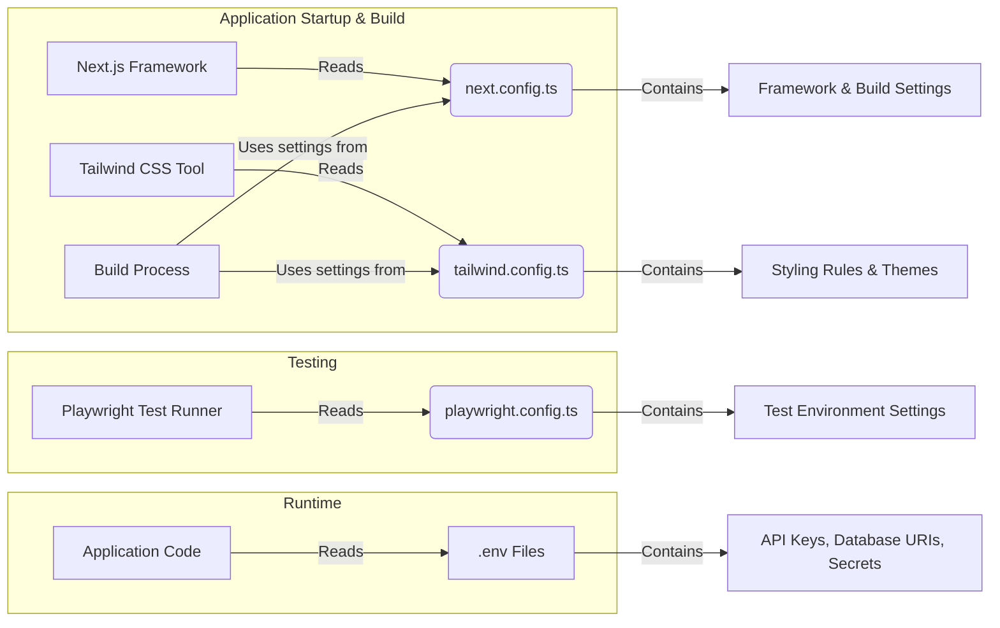

# Chapter 6: Configuration Files

In the previous chapter, [Prompt Engineering](05_prompt_engineering_.md), we learned how to write instructions (prompts) to guide the chatbot's AI brain. Those prompts are a specific kind of setting that controls the AI's behavior. But our application has many other parts besides the AI – the user interface, the build process, the testing setup – and these parts also need their own instructions and settings.

Where do we keep all these different settings organized? That's where **Configuration Files** come in!

## What's the Big Idea? The App's Settings Menu

Imagine you just got a new phone. You probably go into the "Settings" app to customize things like the screen brightness, Wi-Fi connections, notification sounds, and maybe the look and feel (like dark mode).

**Configuration Files** are like the **Settings Menu** or **Control Panel** for our `epdocs-chatbot` application.

*   **They Define How Things Work:** Instead of burying settings deep inside the main code, we put them in dedicated files. These files contain options, switches, and parameters that control how different parts of the application behave.
*   **Different Files for Different Jobs:** Just like your phone has separate settings for "Display," "Sound," and "Network," our project uses different configuration files for different tools or frameworks:
    *   How the website framework (Next.js) builds and runs.
    *   How the user interface styling (Tailwind CSS) looks.
    *   How automated tests (Playwright) are executed.
    *   Special adjustments needed during the code build process (like for syntax highlighting with Prism.js).
    *   Sensitive information like API keys or database connection strings (often stored in special `.env` files).
*   **Easy to Find and Change:** Keeping settings in these specific files makes it easier for developers to find and adjust the application's behavior without digging through complex code.

So, configuration files are essential for setting up and customizing how the application is built, looks, runs, and gets tested.

## How it Works: Reading the Instructions

Different tools and parts of our application are designed to look for and read these configuration files when they start or when they need to perform a specific task.

1.  **Building the App:** When we build the application code to get it ready for deployment, the build tools look at files like `next.config.ts` and `tailwind.config.ts`.
    *   `next.config.ts` tells the Next.js framework about any custom build steps or server settings.
    *   `tailwind.config.ts` tells the Tailwind CSS tool which styles to generate based on our custom themes or design choices.
2.  **Running Tests:** When we run automated tests using Playwright, the Playwright tool reads `playwright.config.ts`. This file tells it things like:
    *   Which web browsers to test against (Chrome, Firefox, Safari).
    *   The web address (URL) of the application to test.
    *   How many times to retry a failed test.
3.  **Running the App:** When the application runs, it might need sensitive information like API keys (remember the `token` from [API Execution Tools](04_api_execution_tools_.md)?) or the database address (used in [Knowledge Retrieval (Vector Search)](03_knowledge_retrieval__vector_search__.md)). This information is often loaded from special environment variable files (like `.env`) to keep secrets out of the main codebase.

Here's a simple diagram showing how different parts read their configuration:



## Under the Hood: A Look at Some Config Files

Let's peek inside a few examples from the `epdocs-chatbot` project. Don't worry about understanding every detail; focus on the *idea* that these files contain settings.

**1. Styling with Tailwind CSS (`tailwind.config.ts`)**

This file configures Tailwind CSS, the tool we use to style the user interface (buttons, text, layout, etc.).

```typescript
// File: tailwind.config.ts (Simplified)
import type { Config } from "tailwindcss";

export default {
  // Tells Tailwind where to look for style class names in our code
  content: [
    "./src/pages/**/*.{js,ts,jsx,tsx,mdx}",
    "./src/components/**/*.{js,ts,jsx,tsx,mdx}",
    "./src/app/**/*.{js,ts,jsx,tsx,mdx}",
  ],
  // Defines custom settings, like colors
  theme: {
    extend: {
      colors: {
        // Define custom color names linked to CSS variables
        background: "var(--background)",
        foreground: "var(--foreground)",
      },
      // Custom settings for typography (text styles)
      typography: { /* ... typography settings ... */ },
    },
  },
  // Enable plugins, like one for styling markdown nicely
  plugins: [
    require('@tailwindcss/typography'),
  ],
  // Enable dark mode based on a CSS selector
  darkMode: 'selector',
} satisfies Config;
```

*   **Explanation:** This file tells Tailwind where our code files are (`content`), defines custom `colors` and text styles (`theme`), adds extra features (`plugins`), and enables `darkMode`. Changing settings here changes the look and feel of the chatbot interface.

**2. Testing with Playwright (`playwright.config.ts`)**

This file configures Playwright, the tool we use for automated end-to-end testing (simulating a user interacting with the chatbot in a browser).

```typescript
// File: playwright.config.ts (Simplified)
import { defineConfig, devices } from '@playwright/test';

export default defineConfig({
  // Where the test files are located
  testDir: './tests',
  // Run tests in parallel for speed
  fullyParallel: true,
  // Number of times to retry failed tests (more retries in CI)
  retries: process.env.CI ? 2 : 0,
  // Base URL of the application to test
  use: {
    baseURL: process.env.TEST_BASE_URL || 'http://localhost:3000',
    // Record steps during the first retry of a failed test
    trace: 'on-first-retry',
  },
  // Define which browsers to test on
  projects: [
    { name: 'chromium', use: { ...devices['Desktop Chrome'] } },
    { name: 'firefox', use: { ...devices['Desktop Firefox'] } },
    { name: 'webkit', use: { ...devices['Desktop Safari'] } },
  ],
  // Settings for starting the web server during tests
  webServer: { /* ... server settings ... */ },
});
```

*   **Explanation:** This file sets the location of tests (`testDir`), how many times to `retries` failed tests, the default web address (`baseURL`) for the application, and which `projects` (browsers) to run the tests against. Changing these settings controls how the automated tests are performed.

**3. Framework and Build Settings (`next.config.ts`)**

This file configures Next.js, our main web framework. It can include various settings, including adjustments to the underlying build process (using a tool called webpack). Here, we adjust how it handles code for syntax highlighting (Prism.js).

```typescript
// File: next.config.ts (Simplified)
import type { NextConfig } from "next";

const nextConfig: NextConfig = {
  /* Other Next.js config options might be here */

  // Customize the webpack build configuration
  webpack: (config) => {
    // Add a rule to handle Prism.js library imports correctly
    config.resolve.alias = {
      ...config.resolve.alias, // Keep existing aliases
      // Map 'prismjs' imports to a specific directory
      'prismjs': 'prismjs/components/',
    };
    // Return the modified configuration
    return config;
  },
};

export default nextConfig;
```

*   **Explanation:** This file tells the Next.js build process (`webpack`) how to find the correct files for the `prismjs` library, which is used for coloring code examples shown in the chat. This ensures the code highlighting works correctly when the application is built.

**4. Sensitive Settings (`.env` files - Not committed to Git!)**

While not shown as a `.ts` file, `.env` files (e.g., `.env.local`) are crucial. They store environment-specific variables, especially secrets like:

*   `OPENAI_API_KEY=sk-...` (For talking to the AI, see [AI Core & Tool Integration (AI SDK)](01_ai_core___tool_integration__ai_sdk__.md))
*   `MONGODB_URI=mongodb+srv://...` (For connecting to the database, see [Knowledge Retrieval (Vector Search)](03_knowledge_retrieval__vector_search__.md))
*   `ELASTICPATH_API_BASE=https://useast.api.elasticpath.com` (For API calls, see [API Execution Tools](04_api_execution_tools_.md))

These files are typically *not* added to version control (like Git) for security reasons. The application reads these values at runtime.

## Conclusion

You've now explored the world of **Configuration Files**, the application's "settings menu." You learned that:

*   They act as a central place to define settings for different parts of the application (styling, testing, building, secrets).
*   They make it easier to customize the app's behavior without changing the core code.
*   Different tools (Next.js, Tailwind, Playwright) read specific configuration files (`next.config.ts`, `tailwind.config.ts`, `playwright.config.ts`) to know how to operate.
*   Sensitive data like API keys are stored separately in `.env` files for security.

These files provide the necessary instructions and parameters to assemble, run, and test the `epdocs-chatbot` correctly. But how do we know if everything is *actually* working correctly once the application is running?

In the next chapter, we'll look at [Instrumentation & Observability](07_instrumentation___observability_.md), which involves adding ways to monitor the application's health and performance and track how users are interacting with it.

---

Generated by [AI Codebase Knowledge Builder](https://github.com/The-Pocket/Tutorial-Codebase-Knowledge)