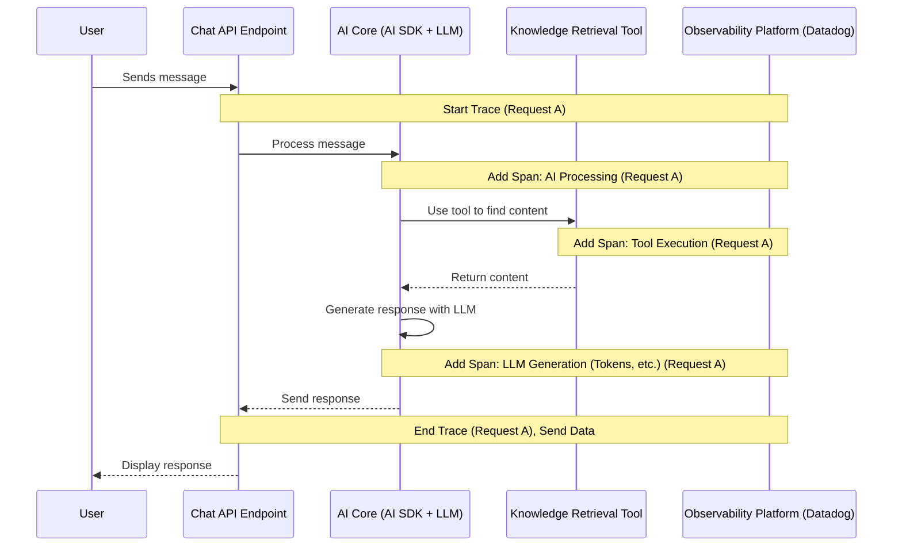

# Chapter 7: Instrumentation & Observability

In the previous chapter, [Configuration Files](06_configuration_files_.md), we saw how settings control how our `epdocs-chatbot` application is built, looks, and runs, including sensitive information like API keys. Now, imagine the chatbot is running, but something seems slow, or maybe it's giving strange answers sometimes. How do we figure out *what's happening inside*?

## What's the Big Idea? Monitoring the Chatbot's Office

Think back to our analogy of the chatbot having different parts like a reception desk ([Chat API Endpoint](02_chat_api_endpoint_.md)), a library ([Knowledge Retrieval (Vector Search)](03_knowledge_retrieval__vector_search__.md)), and API remote controls ([API Execution Tools](04_api_execution_tools_.md)).

**Instrumentation & Observability** is like installing security cameras, performance monitors, and activity logs throughout this entire "office."

*   **Instrumentation:** This is the act of *installing* the monitoring tools. We add special code (like `dd-trace` for Datadog) to our application that knows how to watch and record what's going on.
*   **Observability:** This is the *ability* to understand the internal state of the application by looking at the data collected by the instruments. Can we watch the camera feeds (traces, logs) and read the performance reports (metrics) to see if everything is working smoothly?

Why do we need this?
*   **Debugging:** If the chatbot gives an error, we can look at the logs and traces to see exactly where the process failed.
*   **Performance Tuning:** If the chatbot feels slow, we can see which part of the process (talking to the AI, searching the database, calling an API) is taking the longest.
*   **Understanding AI Behavior:** We can specifically track how the AI ([AI Core & Tool Integration (AI SDK)](01_ai_core___tool_integration__ai_sdk__.md)) is being used: which tools it calls, how many "tokens" (pieces of words) it uses, and if it encounters any issues when generating responses.

This system gives developers the visibility they need to keep the chatbot healthy, fast, and reliable.

## Key Concepts: The Monitoring Toolkit

Let's break down the tools we use to observe the chatbot:

1.  **Tracing:** Imagine following a single person (a user's request) as they walk through the chatbot's office. Tracing connects all the steps a request takes – from arriving at the API endpoint, to the AI thinking, to calling a tool, and finally sending a response. This helps pinpoint bottlenecks or failures in a specific interaction. Tools like Datadog APM (Application Performance Monitoring) use **traces**.
2.  **Metrics:** These are measurements of performance and usage, like numbers on a dashboard. Examples include:
    *   How long did a request take? (Response Time)
    *   How many requests are happening per second? (Throughput)
    *   How many errors occurred? (Error Rate)
    *   How many tokens did the LLM use? (Cost/Usage Metric)
3.  **Logs:** These are like a detailed diary or event log. The application writes messages about important events (like "Starting API call", "Received response from LLM", "Error searching database"). These are useful for detailed debugging after an issue occurs.
4.  **LLM Observability (LLMOps):** This is a specialized part of observability focusing specifically on the Large Language Model interactions. Tools like Datadog's `llmobs` or LangSmith help track:
    *   The exact prompts sent to the LLM.
    *   The responses received.
    *   Which tools the LLM decided to use.
    *   Token counts (input, output, total).
    *   Potential errors during LLM generation or tool use.

## How it Works: Automatic Monitoring

Once instrumentation is set up, much of the monitoring happens automatically.

1.  **App Starts:** When the application starts, special code runs to initialize the monitoring tools (like Datadog's `dd-trace`). It connects to the monitoring service using API keys from our [Configuration Files](06_configuration_files_.md) (e.g., `.env` files).
2.  **Request Arrives:** When a user sends a message to the [Chat API Endpoint](02_chat_api_endpoint_.md), the installed instrumentation automatically starts a **trace**.
3.  **Processing Steps:** As the request moves through different parts of the code (calling the AI SDK, running a tool like `findRelevantContent` or `execGetRequest`), the instrumentation automatically adds **spans** (steps) to the trace, recording how long each step took.
4.  **LLM Interaction:** When the code interacts with the LLM (e.g., using `streamText`), specialized LLM observability hooks capture details like the prompt, response, token usage, and tool calls.
5.  **Data Sent:** Throughout this process, the instrumentation code sends the collected traces, metrics, and logs to the observability platform (like Datadog or Vercel).
6.  **Developers Analyze:** Developers can then log into the observability platform's dashboard to view the traces, check metrics, and search logs to understand the application's health and troubleshoot problems.

Here’s a simplified view of how tracing works:



## Under the Hood: Setting Up the Monitors

Let's look at where the instrumentation code lives.

**1. Initializing Instrumentation (`src/instrumentation.ts`)**

Next.js has a special file (`instrumentation.ts`) that runs when the application server starts. This is where we initialize our monitoring tools.

```typescript
// File: src/instrumentation.ts (Simplified)

// Import observability tools from Vercel and Datadog
import { registerOTel } from "@vercel/otel"; // Vercel's OpenTelemetry setup
import tracer from 'dd-trace'; // Datadog tracer

export function register() {
  // Only run this setup code on the server-side
  if (process.env.NEXT_RUNTIME === 'nodejs') {

    // Initialize Vercel's OpenTelemetry (helps collect traces)
    registerOTel({
      serviceName: "epdocs-chat-dd", // Name shown in monitoring dashboards
    });

    // Initialize the Datadog tracer
    console.log(`Setting up Datadog trace...`);
    tracer.init({
      service: 'epdocs-chat-dd', // Match the service name
      env: process.env.DD_ENV, // Environment (e.g., 'production', 'dev')
      // Enable special Datadog LLM Observability features
      llmobs: {
        mlApp: process.env.DD_LLMOB_ML_APP, // App name in LLM Observability
        agentlessEnabled: true // Use automatic LLM tracking
      }
      // API Key is usually picked up from DD_API_KEY environment variable
    });

    // Make Datadog's llmobs feature globally available if needed elsewhere
    (global as any).llmobs = tracer.llmobs;
  }
}
```

*   **Explanation:**
    *   This code runs automatically when the chatbot server starts up.
    *   It checks if it's running on the server (`nodejs`).
    *   `registerOTel` sets up basic tracing compatible with Vercel's platform.
    *   `tracer.init` configures the Datadog tracer, telling it the `service` name and `env` (environment). Importantly, it enables `llmobs` for detailed AI monitoring.
    *   These tools use configuration settings (like API keys or environment names) often loaded from `.env` files, as discussed in [Configuration Files](06_configuration_files_.md).

**2. Tracking LLM Calls in the API Endpoint (`src/app/api/chat/route.ts`)**

While `dd-trace` automatically instruments many things, we can add specific annotations for LLM calls to provide richer data to Datadog LLM Observability.

```typescript
// File: src/app/api/chat/route.ts (Simplified Snippet)

import { streamText } from 'ai'; // Vercel AI SDK function
import { openai } from '@ai-sdk/openai';
import { llmobs } from 'dd-trace'; // Import Datadog LLMObs helper

// ... other imports and tool definitions ...

export async function POST(request: Request) {
    const { messages, useTools } = await request.json();
    const latestMessage = messages[messages?.length - 1]?.content;
    // ... setup code for prompts and tools ...

    try {
        const result = streamText({
            model: openai('gpt-4o'),
            messages: [ /* system prompt + message history */ ],
            tools: { /* chosen tools */ },
            toolChoice: 'auto',
            // This function runs AFTER the LLM call is finished
            onFinish: ({ usage, text }) => {
                const { promptTokens, completionTokens, totalTokens } = usage;
                console.log('LLM interaction finished. Logging to Datadog LLMObs...');
                console.log('Total tokens:', totalTokens);

                // Use Datadog llmobs to manually trace/annotate this LLM call
                llmobs.trace(
                    // Metadata about the LLM call itself
                    { kind: 'llm', name: 'epdocs-chat-llm', modelName: 'gpt-4o', modelProvider: 'openai' },
                    // A function containing the data we want to annotate
                    () => {
                        llmobs.annotate({
                            // Input and Output data for the LLM call
                            inputData: [{ content: `${latestMessage}`, role: 'user' }], // Simplified input
                            outputData: { content: `${text}`, role: 'ai' },
                            // Custom tags (e.g., which Vercel deployment)
                            tags: { host: process.env.NEXT_PUBLIC_VERCEL_URL },
                            // Key performance metrics
                            metrics: { inputTokens: promptTokens, outputTokens: completionTokens, totalTokens: totalTokens }
                        });
                    }
                );
            },
        });

        return result.toDataStreamResponse();

    } catch (error) {
        console.error('Error in streamText:', error);
        // Errors here might also be captured by automatic tracing
        throw error;
    }
}
```

*   **Explanation:**
    *   We import the `llmobs` helper from `dd-trace`.
    *   Inside the `onFinish` callback of the `streamText` function (which runs after the AI interaction completes), we get the final `text` and token `usage`.
    *   We call `llmobs.trace()` to explicitly record this specific LLM interaction.
    *   Inside `llmobs.annotate()`, we provide detailed information:
        *   `inputData` and `outputData`: What went into and came out of the LLM.
        *   `tags`: Extra searchable labels.
        *   `metrics`: Key performance indicators like token counts.
    *   This sends rich, AI-specific data to Datadog, making it much easier to understand and debug the chatbot's core AI behavior.

## Conclusion

You've now learned about **Instrumentation & Observability**, the essential practice of monitoring our `epdocs-chatbot`. You understand:

*   **Instrumentation** is adding the monitoring tools (like Datadog's `dd-trace`).
*   **Observability** is the ability to understand the system's health using the collected **traces**, **metrics**, and **logs**.
*   Specialized **LLM Observability** helps us track AI interactions, including prompts, responses, tool usage, and token counts.
*   Code in `src/instrumentation.ts` initializes the monitoring, and specific annotations (like in `src/app/api/chat/route.ts`) can enrich the data for AI calls.

By setting up these "security cameras and performance monitors," developers gain crucial insights into how the chatbot is performing, allowing them to fix issues quickly, optimize performance, and ensure the AI is behaving as expected. This concludes our tour through the core components of the `epdocs-chatbot` project!

---

Generated by [AI Codebase Knowledge Builder](https://github.com/The-Pocket/Tutorial-Codebase-Knowledge)