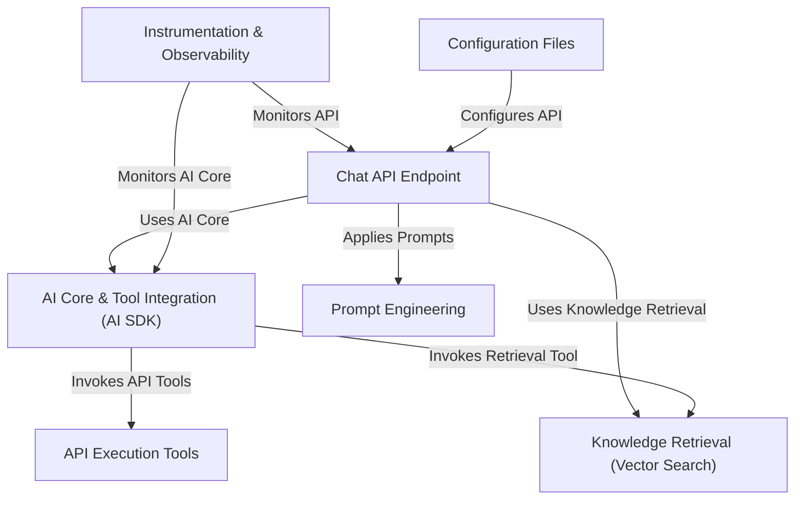

# Tutorial: epdocs-chatbot

This project is an **AI-powered chatbot** designed to answer questions about *Elastic Path* documentation and APIs.
It receives user questions through a **chat interface**, uses an *AI model* to understand the query, and retrieves relevant information from a specialized **knowledge base** (using vector search).
The chatbot can also interact with external *Elastic Path APIs* if needed to provide more specific answers, before streaming the final response back to the user.

**Source Repository:** [None](None)

## Chapters

1. [AI Core & Tool Integration (AI SDK)
](01_ai_core___tool_integration__ai_sdk__.md)
2. [Chat API Endpoint
](02_chat_api_endpoint_.md)
3. [Knowledge Retrieval (Vector Search)
](03_knowledge_retrieval__vector_search__.md)
4. [API Execution Tools
](04_api_execution_tools_.md)
5. [Prompt Engineering
](05_prompt_engineering_.md)
6. [Configuration Files
](06_configuration_files_.md)
7. [Instrumentation & Observability
](07_instrumentation___observability_.md)

---

Generated by [AI Codebase Knowledge Builder](https://github.com/The-Pocket/Tutorial-Codebase-Knowledge)